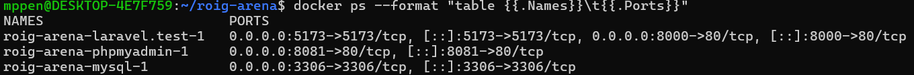

# Guía de Configuración - Proyecto Roig Arena
> Documentación basada en la instalación, incluyendo problemas y soluciones encontradas.

---

## Entorno
- **OS:** Windows 11 con WSL2 (Ubuntu)
- **PHP:** 8.3.6
- **Laravel:** 13.7.0
- **Docker Desktop:** 29.4.1
- **Sanctum:** v4.3.1

---

## FASE 1: INSTALACIÓN

### 1.1 Instalar Docker Desktop

**Problema encontrado:** El instalador fallaba con el error:
> `For security reasons C:\ProgramData\DockerDesktop must be owned by an elevated account`

**Solución:** Ejecutar el instalador desde PowerShell como administrador:
```powershell
Start-Process "C:\Users\mppen\Downloads\Docker Desktop Installer.exe" -Verb RunAs -Wait
```

Después de instalar, activar la integración con WSL:
- Abrir Docker Desktop → Settings ⚙️ → Resources → WSL Integration
- Activar ✅ "Enable integration with my default WSL distro"
- Activar ✅ Ubuntu
- Clic en "Apply & Restart"

Verificar que funciona desde WSL:
```bash
docker --version
# Docker version 29.4.1, build 055a478
```

---

### 1.2 Instalar Laravel Sail

Desde WSL, instalar curl si no está disponible:
```bash
sudo apt update && sudo apt install curl -y
```

Crear el proyecto con PHP 8.3:
```bash
curl -s "https://laravel.build/roig-arena?php=83&with=mysql" | bash
cd roig-arena
```

**Problema encontrado:** El Dockerfile intentaba instalar PHP 8.5 que no existe en los repositorios, y no podía conectar al PPA de Ondrej (`ppa.launchpadcontent.net`).

**Solución:** Reemplazar el Dockerfile de 8.3 con una versión simplificada que usa los repositorios oficiales de Ubuntu:
```bash
cat > ~/roig-arena/vendor/laravel/sail/runtimes/8.3/Dockerfile << 'EOF'
FROM ubuntu:24.04
LABEL maintainer="Taylor Otwell"

ARG WWWGROUP
ARG NODE_VERSION=20
ARG MYSQL_CLIENT="default-mysql-client"
ARG POSTGRES_VERSION=15

WORKDIR /var/www/html

ENV DEBIAN_FRONTEND=noninteractive
ENV TZ=UTC
ENV LANG=C.UTF-8
ENV SUPERVISOR_PHP_USER="sail"

RUN ln -snf /usr/share/zoneinfo/$TZ /etc/localtime && echo $TZ > /etc/timezone

RUN apt-get update && apt-get upgrade -y \
    && apt-get install -y gnupg gosu curl ca-certificates zip unzip git supervisor sqlite3 libcap2-bin libpng-dev python3 dnsutils nano \
    && apt-get install -y \
        php8.3-cli php8.3-dev \
        php8.3-mysql php8.3-mbstring \
        php8.3-xml php8.3-zip php8.3-bcmath \
        php8.3-intl php8.3-readline \
        php8.3-curl php8.3-gd \
        php8.3-sqlite3 \
    && curl -sLS https://getcomposer.org/installer | php -- --install-dir=/usr/bin/ --filename=composer \
    && apt-get install -y nodejs npm \
    && apt-get -y autoremove \
    && apt-get clean \
    && rm -rf /var/lib/apt/lists/* /tmp/* /var/tmp/*

RUN setcap "cap_net_bind_service=+ep" /usr/bin/php8.3
RUN groupadd --force -g $WWWGROUP sail
RUN useradd -ms /bin/bash --no-user-group -g $WWWGROUP -u 1337 sail

COPY start-container /usr/local/bin/start-container
COPY supervisord.conf /etc/supervisor/conf.d/supervisord.conf
COPY php.ini /etc/php/8.3/cli/conf.d/99-sail.ini
RUN chmod +x /usr/local/bin/start-container

EXPOSE 80/tcp
ENTRYPOINT ["start-container"]
EOF
```

**Problema encontrado:** El `supervisord.conf` usaba variables de entorno con sintaxis antigua que causaba el error:
> `You should set SUPERVISOR_PHP_USER to either 'sail' or 'root'`

**Solución:** Reemplazar el supervisord.conf:
```bash
cat > ~/roig-arena/vendor/laravel/sail/runtimes/8.3/supervisord.conf << 'EOF'
[supervisord]
nodaemon=true
user=root
logfile=/var/log/supervisor/supervisord.log
pidfile=/var/run/supervisord.pid

[program:php]
command=/usr/bin/php -d variables_order=EGPCS /var/www/html/artisan serve --host=0.0.0.0 --port=80
user=sail
environment=LARAVEL_SAIL="1"
stdout_logfile=/dev/stdout
stdout_logfile_maxbytes=0
stderr_logfile=/dev/stderr
stderr_logfile_maxbytes=0
EOF
```

Crear el `docker-compose.yml` manualmente (no se generó automáticamente):
```bash
cat > ~/roig-arena/docker-compose.yml << 'EOF'
services:
    laravel.test:
        build:
            context: ./vendor/laravel/sail/runtimes/8.3
            dockerfile: Dockerfile
            args:
                WWWGROUP: '${WWWGROUP}'
        image: sail-8.3/app
        extra_hosts:
            - 'host.docker.internal:host-gateway'
        ports:
            - '${APP_PORT:-80}:80'
            - '${VITE_PORT:-5173}:${VITE_PORT:-5173}'
        environment:
            WWWUSER: '${WWWUSER}'
            LARAVEL_SAIL: 1
            XDEBUG_MODE: '${SAIL_XDEBUG_MODE:-off}'
            XDEBUG_CONFIG: '${SAIL_XDEBUG_CONFIG:-client_host=host.docker.internal}'
            IGNITION_LOCAL_SITES_PATH: '${PWD}'
        volumes:
            - '.:/var/www/html'
        networks:
            - sail
        depends_on:
            - mysql
    mysql:
        image: 'mysql/mysql-server:8.0'
        ports:
            - '${FORWARD_DB_PORT:-3306}:3306'
        environment:
            MYSQL_ROOT_PASSWORD: '${DB_PASSWORD}'
            MYSQL_ROOT_HOST: '%'
            MYSQL_DATABASE: '${DB_DATABASE}'
            MYSQL_USER: '${DB_USERNAME}'
            MYSQL_PASSWORD: '${DB_PASSWORD}'
            MYSQL_ALLOW_EMPTY_PASSWORD: 1
        volumes:
            - 'sail-mysql:/var/lib/mysql'
        networks:
            - sail
        healthcheck:
            test:
                - CMD
                - mysqladmin
                - ping
                - '-p${DB_PASSWORD}'
            retries: 3
            timeout: 5s
    phpmyadmin:
        image: phpmyadmin/phpmyadmin
        environment:
            PMA_HOST: mysql
            PMA_PORT: 3306
        ports:
            - '8081:80'
        networks:
            - sail
        depends_on:
            - mysql
networks:
    sail:
        driver: bridge
volumes:
    sail-mysql:
        driver: local
EOF
```

Arreglar permisos y arrancar:
```bash
chmod -R 777 ~/roig-arena/storage
chmod -R 777 ~/roig-arena/bootstrap/cache
chmod -R 777 ~/roig-arena/database
sail root-shell
chmod -R 777 /var/www/html
exit
./vendor/bin/sail down -v
./vendor/bin/sail build --no-cache
./vendor/bin/sail up -d
```

Verificar que funciona:
```bash
docker ps --format "table {{.Names}}\t{{.Ports}}"
```

Laravel: http://localhost:8000

phpMyAdmin: http://localhost:8081 (usuario: `sail`, contraseña: `password`)



---

### 1.3 Alias de Sail

Para no escribir `./vendor/bin/sail` cada vez:
```bash
echo "alias sail='./vendor/bin/sail'" >> ~/.bashrc
source ~/.bashrc
```

Verificar:
```bash
sail artisan --version
# Laravel Framework 13.7.0
```

---

### 1.4 Comandos útiles

| Acción | Comando |
|---|---|
| Iniciar servicios | `sail up -d` |
| Detener servicios | `sail down` |
| Detener y borrar volúmenes | `sail down -v` |
| Ejecutar migraciones | `sail artisan migrate` |
| Rehacer todas las migraciones | `sail artisan migrate:fresh` |
| Crear modelo | `sail artisan make:model NombreModelo` |
| Crear migración | `sail artisan make:migration create_tabla_table` |
| Crear controlador | `sail artisan make:controller NombreController` |
| Consola interactiva | `sail artisan tinker` |
| Entrar al contenedor | `sail bash` |
| Entrar como root | `sail root-shell` |
| Limpiar caché | `sail artisan optimize:clear` |

---

## FASE 2: BASE DE DATOS

### Migración de users modificada
Archivo: `database/migrations/0001_01_01_000000_create_users_table.php`

Cambios: añadir `nombre`, `apellido`, `is_admin` y `softDeletes`.

### Migración principal
Archivo: `database/migrations/XXXX_create_roig_arena_tables.php`

Contiene todas las tablas en orden: `sectores` → `asientos` → `eventos` → `precios` → `estado_asientos` → `entradas`

Ejecutar:
```bash
sail artisan migrate
```

Tablas resultantes: `users`, `sectores`, `asientos`, `eventos`, `precios`, `estado_asientos`, `entradas`, `personal_access_tokens` + tablas del sistema Laravel.

---

## FASE 3: MODELOS

Modelos creados en `app/Models/`:
- `User.php` — con `HasApiTokens`, `SoftDeletes`, relaciones con reservas y entradas
- `Sector.php` — con relaciones a asientos, precios y eventos
- `Asiento.php` — con métodos de disponibilidad por evento
- `Evento.php` — con `SoftDeletes`, scopes de futuros/pasados/delMes
- `Precio.php` — con verificación de disponibilidad combinada (sector + precio)
- `EstadoAsiento.php` — con temporizador de reserva y scope de expirados
- `Entrada.php` — con generación automática de código QR en boot()

---

## FASE 4: AUTENTICACIÓN

Instalar Sanctum:
```bash
sail composer require laravel/sanctum
sail artisan install:api
```

Controlador: `app/Http/Controllers/Auth/AuthController.php`
 
| Ruta | Método | Descripción |
|---|---|---|
| `/api/register` | POST | Registro de usuario |
| `/api/login` | POST | Inicio de sesión |
| `/api/logout` | POST | Cierre de sesión (requiere token) |
| `/api/user` | GET | Usuario autenticado (requiere token) |
 
Probar registro:
```bash
curl -X POST http://localhost:8000/api/register \
  -H "Content-Type: application/json" \
  -H "Accept: application/json" \
  -d '{"nombre":"Juan","apellido":"Garcia","email":"juan@test.com","password":"password123","password_confirmation":"password123"}'
```
 
Probar login:
```bash
curl -X POST http://localhost:8000/api/login \
  -H "Content-Type: application/json" \
  -H "Accept: application/json" \
  -d '{"email":"juan@test.com","password":"password123"}'
```
 
---
 
## FASE 5: CONTROLADORES, RESOURCES Y SERVICES
 
### Estructura de archivos
 
```
app/
├── Console/Commands/
│   └── LiberarReservasExpiradas.php
├── Http/
│   ├── Controllers/
│   │   ├── Auth/AuthController.php
│   │   ├── EventoController.php
│   │   ├── SectorController.php
│   │   ├── AsientoController.php
│   │   ├── ReservaController.php
│   │   ├── CompraController.php
│   │   └── EntradaController.php
│   ├── Middleware/
│   │   └── IsAdmin.php
│   └── Resources/              ⚠️ Va en app/Http/Resources/ NO en resources/
│       ├── UserResource.php
│       ├── EventoResource.php
│       ├── SectorResource.php
│       ├── AsientoResource.php
│       ├── PrecioResource.php
│       ├── ReservaResource.php
│       └── EntradaResource.php
└── Services/
    ├── ReservaService.php
    ├── CompraService.php
    └── LiberarReservasService.php
```
 
### Crear archivos con Artisan
 
```bash
# Controladores
sail artisan make:controller EventoController
sail artisan make:controller SectorController
sail artisan make:controller AsientoController
sail artisan make:controller ReservaController
sail artisan make:controller CompraController
sail artisan make:controller EntradaController
 
# Resources
sail artisan make:resource UserResource
sail artisan make:resource EventoResource
sail artisan make:resource SectorResource
sail artisan make:resource AsientoResource
sail artisan make:resource PrecioResource
sail artisan make:resource ReservaResource
sail artisan make:resource EntradaResource
 
# Middleware
sail artisan make:middleware IsAdmin
 
# Comando programado
sail artisan make:command LiberarReservasExpiradas
 
# Carpeta Services (manual)
mkdir ~/roig-arena/app/Services
```
 
### Registrar middleware en bootstrap/app.php
 
```php
->withMiddleware(function (Middleware $middleware) {
    $middleware->api(prepend: [
        \Laravel\Sanctum\Http\Middleware\EnsureFrontendRequestsAreStateful::class,
    ]);
    $middleware->alias([
        'verified' => \App\Http\Middleware\EnsureEmailIsVerified::class,
        'admin' => \App\Http\Middleware\IsAdmin::class,
    ]);
})
```
 
### Comando programado en routes/console.php
 
```php
Schedule::command('reservas:liberar')->everyMinute();
```
 
### Rutas API — 21 rutas totales
 
```
PÚBLICAS:
POST   /api/register
POST   /api/login
GET    /api/eventos
GET    /api/eventos/{id}
GET    /api/eventos/{eventoId}/asientos
GET    /api/eventos/{eventoId}/sectores/{sectorId}/asientos
 
PROTEGIDAS (auth:sanctum):
GET    /api/user
POST   /api/logout
GET    /api/reservas
POST   /api/reservas
DELETE /api/reservas/{id}
POST   /api/compra
GET    /api/entradas
GET    /api/entradas/{id}
 
ADMIN (auth:sanctum + admin):
POST   /api/eventos
PUT    /api/eventos/{id}
DELETE /api/eventos/{id}
GET    /api/sectores
POST   /api/sectores
PUT    /api/sectores/{id}
DELETE /api/sectores/{id}
```
 
Verificar rutas:
```bash
sail artisan route:list --path=api
```
 
Si hay problemas de clases no encontradas:
```bash
sail artisan optimize:clear
sail composer dump-autoload
```